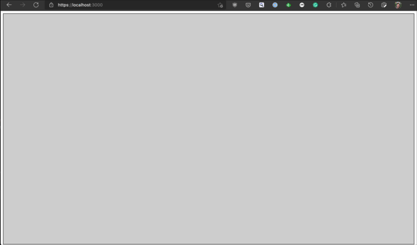
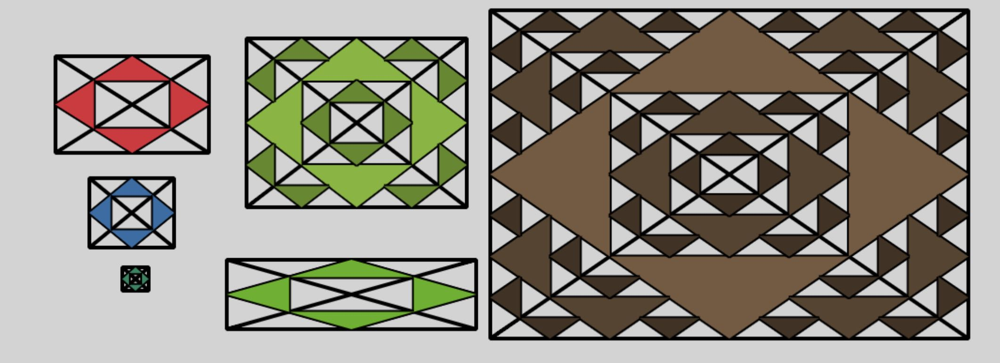

# Assignment 0:  Typescript, Web, Simple Graphics warmup 

This repository implements the starting point of a small interactive program in TypeScript.

## Due: Wednesday September 1st, 11:59pm

## Rubric

Graded out of 10.

1. Grey hollow rectangle renders from mouse down to current mouse position while mouse is held: 3
4. When the mouse button is released a rectangle and cross-lines with thick black border is shown (a rectangle divided into 4 empty triangles): 2  (1 for the first rectangle, 1 for keeping track of all rectangles)
5. First subdivision happens regardless of the size of the rectangle, creating 4 triangles of the same random color inside inside the initial triangles: 1 
6. Recursively draw more triangles based on min(width, height) of the rectangle: 2  (0.5 for drawing at least 1 additional set of colored triangles, 1 for recursing to the correct depth, 0.5 for darkening color with each recursive step)
1. Keep track of the most recent mouse positions (using Pointset): 1 (0.5 for adding new elements, 0.5 for removing them over time)
2. Use the mouse positions in Pointset to draw fading blue "dots" (as tiny rectangles): 1  (0.5 for drawing at least one rectangle, 0.25 for drawing all points, 0.25 for fading dots using alpha)

## Overview and Learning Goals

The goal of this assignment is to allow you to self-assess whether you are prepared to take this class.  As such, even if you do not plan to do the assignment until after the drop deadline, you should look at it and think about it, to make sure you are comfortable with what I am asking you to do.

There are a variety of sub-goals to this project, all related to the major goal. You will get some initial experience with Typescript, use a simple data structure common in graphics (a circular buffer), gain experience with the common structure of interactive graphical program (not specific to the web), implement a solution to a small geometric problem, and (not least of which) ensure your development and debugging environments are set up before the first larger assignment.

Your assignment is to complete the implementation of app.ts so that the program behaves as demonstrated in class and described here and in the code comments.  The result should look like this:



## Requirements

Here are some details requirements and guidance for what we expect.

1. app.ts contains a starting point for the code for this example, you will complete it. We've left in a lot of useful code that we don't want you to have to implement, and marked two places (with TODO comments) that you will want to add code.  You will need to create some new methods as well, to handle things like computing midpoints of lines and recursively drawing triangles.
2. pointset.ts contains the PointSet class that you should use to keep track of a fixed maximum number of mouse points.  You do not need to modify this, but should make sure you understand it (as a self-assessment tool).  PointSet implements as a circular buffer, as described in the comments in the file. The key feature of a circular buffer is that the contents of the buffer are never moved or copied as new elements are added or removed. Instead, the index markers for the start and end are updated. This is a common data structure in interactive applications, because it gives direct access to each element of the buffer, does not require allocations or copying, or many small allocations of memory that may fragment memory (and trigger the garbage collector in a dynamic language like Javascript). The interface methods of the class hide the implementation details from the programmer: they can simply request the first, second, third, etc. element as desired.
3. your program should create one "point" per animationFrame and store 30 points (1 second worth of data at 30 frames per second, 1/2 a second at 60 fps, and so on). The points should be rendered such that they appear to fade out as the mouse moves, by setting the alpha value of the color being used to increasing levels of transparency based on the number of points.  New points should not be created when the mouse is outside of the canvas, but old ones should continue to disappear until they are all gone.
4. when the user clicks and drags, a grey hollow rectangle should be traced out from the start point to the current mouse location as the mouse moves and the button is held.  
5. when the user releases the button, a rectangle with a thick black border should be drawn that is the same size and location as the final grey rectangle drawn when dragging the mouse.  It should contain two lines that cross the center from the four corners, creating four triangles. 
6. information needed to redraw the rectangle should be saved (the corners). A random color should be created and saved with this rectangle.
7. if the user moves the mouse out of the canvas before releasing the button, the rectangle creation should be canceled.
8. inside each of the first 4 triangles, a new triangle of should be drawn using the rectangle's assigned color. Each new triangle should use the mid-points of each of the sides of the enclosing triangle as it's corners.
9. additional triangles will be created recursively based on the size of the rectangle (see more details on what should be drawn, below).  
10. the canvas should be redrawn each animation frame, with each of the created rectangles being rendered. Nothing should be drawn in the canvas outside of the render function.

## Recursion 

Based on the size of the original rectangle, you will recursively draw more triangles inside the empty triangles created when a triangle is drawn.  Each time a triangle is drawn inside another triangle, it subdivides the triangle into 4 equal triangles: the center one being filled (the "drawn" triangle) and 3 empty ones that share a vertex with the enclosing triangle.

Based in the size of the rectangle, you will recursively drawn a new triangle inside each of these 3 empty triangles, meaning 3 more triangles are drawn for each triangle in the step above. 

When a triangle is drawn inside another triangle, it should have a black border (like the enclosing triangle), and be filled with the color that was randomly chosen when the rectangle was created. The color assigned to the rectangle should not change over time, but each time you recursively draw more triangles, their color should be slightly darker than then the triangle containing them

The number of recursion steps based on size of the rectangle the user drew. Consider the "size" to be the smaller of the width and height of the rectangle.  If the size is > 128, you should recurse one step after the initial 4 colored triangles.  For each power of two above 128, you should recurse one more step (256 = 2 steps, 512 = 3 steps). 0, 1, and 2 recursion steps are shown in the image below.



The first column shows rectangles whose width and height are less than 128 each (sized at 163x103, 90x74, 28x25), as does the short rectangle on the bottom of the second column (sized at 265x74).  The top of the second column shows 1 recursive step (size 234x180), with each of the original empty triangles containing a slightly darker green triangle.  The third column shows 2 recursive steps (size 508x350).

Your grade will be based on satisfying each of these requirements, according to the rubric above.

# Submission

You will check out the project from github classroom, and submit it there.  The project folder should contain just the additions to the sample project that are needed to implement the project. Do not add extra files, and do not remove the .gitignore file (we do not want the "node_modules" directory in your repository.)

**Do Not Change the names** of the existing files (e.g., index.html, app.ts, etc).  The TAs need to be able to test your program as follows:

1. cd into the directory and run ```npm install```
2. run with ```npm run dev```
3. visit ```http://localhost:3000/index.html```

Please test that your submission meets these requirements.  For example, after you check in your final version of the assignment to github, check it out again to a new directory and make sure everything builds and runs correctly.
 
## Development Environment

The sample has already been set up with a complete project for Typescript development.

To work with this sample and prepare your submission, you should have Node (and in particular, npm) installed, which you can retrieve from [nodejs.org](http://nodejs.org). (We recommend first installing nvm [[Mac/Linux](https://github.com/nvm-sh/nvm)] [[Windows](https://github.com/coreybutler/nvm-windows)] and using it to install node.)

You do not need to install anything else globally, as typescript and all the tools will be installed inside your project.

This project uses [Vite](https://vitejs.dev/), a fast, lightweight, modern build-and-dev tool that leverages [Rollup](https://rollupjs.org/guide/en/) as its bundler and supports hot-module-replacement. 

## Running and Debugging

The development environment for vite is run using the npm "dev" script in the package.json file, using ```npm run dev```.  This starts the vite server, and should show you something like 
```
  vite v2.4.4 dev server running at:

  > Local: https://localhost:3000/
  > Network: use `--host` to expose

  ready in 384ms.
```
You can then access the server from your web browser at the listed url (```https://localhost:3000``` in this case).

Vite supports hot-module-replacement, so when you edit and save any file in your project, the program will be reloaded in your browser. 

You can use your browser's development tools for debugging.